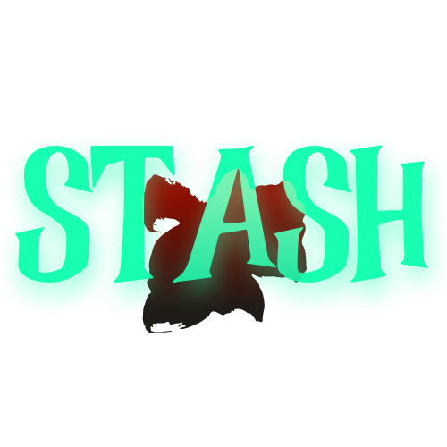

## Universal Uno Card Representation (UUR)
### Aim
- A card can be represented by a byte
- All information about a particular card can be access it's number

### Binary representation 
- in a byte

|Bits|Details|Variations|
|------|-----|--------|
|00|type|0-number 1-plus2 2-plus4 3-reverse|
|00|color|0-red 1-green 2-blue 3-yellow|
|0000|number|decimal equilavent(0-9)|
eg: 
- 11_00_0000 is *(uncolored) reverse*\

- 10 is *(numbered, red) 2*\

- 10_00_0000 is *(uncolored) 4*
- 

*Internal Documentation of Stash. Pictures and media captured from game*
